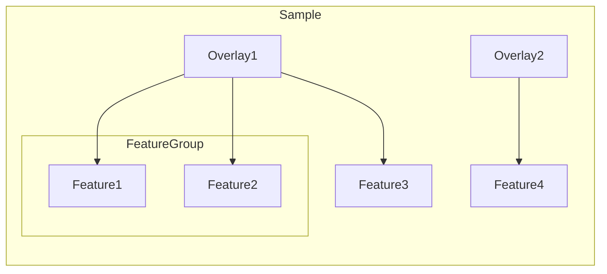

# ➰ Loopy Browser

[](https://github.com/chaichontat/loopy-browser/actions/workflows/data_prep.yml)

Loopy Browser is a performant visualization tool for spatial transcriptomics experiments.

## Usage

Head over to https://loopybrowser.com/ to see the Loopy Browser with example Visium-IF data.

You need to preprocess an image prior to being used in the Loopy Browser.
See the preprocessing package installation details below.

### Example Preprocessing

Download a sample TIFF image from https://data.loopybrowser.com/VisiumIF/sample.tif.
Install the preprocessing system.
Call the preprocessing GUI with the following command in the terminal.

#### GUI
```sh
conda activate loopy
loopy gui
```


#### In the command line
```sh
conda activate loopy
loopy image [PATH TO IMAGE] --scale 0.497e-6 --channels Lipofuscin,DAPI,GFAP,NeuN,OLIG2,TMEM119
```
In this case, the output folder has the same name as the input file.

You can drag this folder to https://loopybrowser.com/.
Despite the Browser being a webpage, all data are processed locally on your computer.

**This link opens the expected result: https://loopybrowser.com/from?url=data2.loopybrowser.com/VisiumIF/&s=sample.**

Here, the browser retrieves the processed folder hosted on an external server.
You could share your files with your collaborators using your own file server or AWS S3.
More reasonably priced alternatives include [Cloudflare R2](https://www.cloudflare.com/products/r2/) and [Backblaze B2](https://www.backblaze.com/b2/cloud-storage.html).
The images are available instantly and without any installation on their end!

## Installation

Install [`conda`](https://github.com/conda-forge/miniforge#miniforge3) using these video guides: [Mac](https://www.youtube.com/watch?v=328DQUWZP48) and [Windows](https://www.youtube.com/watch?v=-H_onyfW9VE). Then, in the Terminal, run

```sh
git clone https://github.com/chaichontat/loopy-browser/
cd loopy-browser
conda env create -n loopy -f environment.yml
```

## Nomenclature

Being compatible with static hosting, Loopy Browser has most of its data all precomputed.

- `sample.json`: this contains the overall detail of the sample, such as its names and list of features.
- `{features}.json`: these are either headers for `ChunkedJSON` or headers and data for `PlainJSON`.


