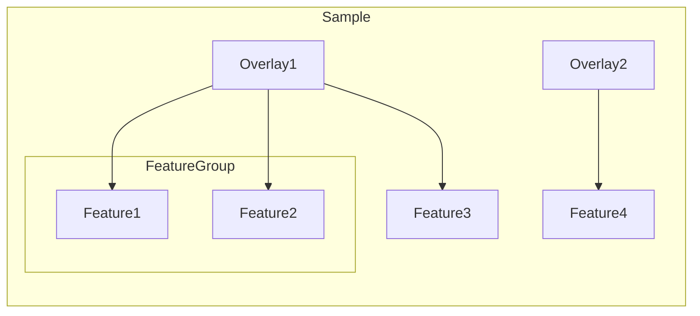

# 🏝️ Samui

[](https://zenodo.org/badge/latestdoi/482243832)

[](https://github.com/chaichontat/samui/actions/workflows/humanpilot.yml)

Samui (named for an island located in Gulf of Thailand Ko Samui pronounced gaw -- rhyming with raw -- sà mui) is a performant visualization tool for spatial transcriptomics experiments.

**Preprint available now!** [Performant web-based interactive visualization tool for spatially-resolved transcriptomics experiments](https://www.biorxiv.org/content/10.1101/2023.01.28.525943v2).

## Usage

Head over to <https://samuibrowser.com/> to see Samui with example Visium-IF data.

You need to preprocess your image to form a tiled structure prior to being used in the Samui.

## Installation

Install [`conda`](https://github.com/conda-forge/miniforge#miniforge3). These video guides can be helpful: [Mac](https://www.youtube.com/watch?v=328DQUWZP48) and [Windows](https://www.youtube.com/watch?v=-H_onyfW9VE). Then, in the Terminal, run

```sh
git clone https://github.com/chaichontat/samui/
cd samui
conda env create -n samui -f environment.yml
```

### Preprocessing

For an example case, you can download a sample TIFF image from <https://libd-spatial-dlpfc-loopy.s3.amazonaws.com/VisiumIF/sample.tif>.

#### GUI

The GUI is intended to be a simple wrapper around the Python interface and is limited to only basic options (processing spaceranger results and TIFF images).

##### Option 1: Run from Prepacked Binary

The binaries are available at [Releases](https://github.com/chaichontat/samui/releases) under `Assets`.
Windows users should download the file ending with `.exe` and macOS users should download the file ending with `.zip`, which decompresses to an executable `.app` folder.

For Mac users, you may need to right click on the app and select "Open" to bypass the security check as these binaries are not signed by Apple.

The application may take up to a minute to start up.

##### Option 2: Run from Command Line

Call the preprocessing GUI with the following command in the terminal.

```sh
conda activate samui
loopy gui
```


You can choose a TIFF file to be processed.

The `channels` field is optional. If you want to name the channels, make sure that the number of comma-separated names matches the number of channels in the image.
For the sample image, this field should be `Lipofuscin,DAPI,GFAP,NeuN,OLIG2,TMEM119`.

The output folder will have the same name as the input file and can be dragged directly to <https://samuibrowser.com/> for visualization.

#### In the command line

```sh
conda activate samui
loopy image [PATH TO IMAGE] --scale 0.497e-6 --channels Lipofuscin,DAPI,GFAP,NeuN,OLIG2,TMEM119
```

In this case, the output folder has the same name as the input file.

You can drag this folder directly to <https://samuibrowser.com/>.
Despite the Browser being a webpage, all data are processed locally on your computer.

**This link opens the expected result: <https://samuibrowser.com/from?url=libd-spatial-dlpfc-loopy.s3.amazonaws.com/VisiumIF/&s=sample>.**

Here, the browser retrieves the processed folder hosted on an external server.
You could share your files with your collaborators using your own file server or AWS S3.
More reasonably priced alternatives include [Cloudflare R2](https://www.cloudflare.com/products/r2/) and [Backblaze B2](https://www.backblaze.com/b2/cloud-storage.html).
The images are available instantly and without any installation on their end!

#### Python API

The main object is `Sample` from `loopy.sample`.
This is a Pydantic [model](https://docs.pydantic.dev/usage/models/) which provides nice boilerplates.

The object is chainable, which means that all methods return the object.
The methods are also lazy, which means that the actual data processing only happens when
the `write` method is called.

For example, [scripts/process_merfish.py](scripts/process_merfish.py)

```python
(
    Sample(name="BrainReceptorShowcase1", path=out)
    .add_coords(coords, name="cellCoords", mPerPx=1e-6, size=2e-5)
    .add_chunked_feature(feat, name="cells", coordName="cellCoords", unit="Log counts", sparse=True)
    .add_image(dapi, channels=["DAPI"], scale=affine.a, translate=(affine.c, affine.f))
    .set_default_feature(group="cells", feature="Oxgr1")
    .write()
)
```

This creates a sample folder that has an image along with a list of chunked features at `out/BrainReceptorShowcase1`.
This folder can be dragged directly into Samui for visualization.

#### Hosting a Sample folder

Samui can open a link that points to a sample folder directly from a URL in this format

```
https://samuibrowser.com/from?url=[YOUR URL]&s=[SAMPLE1]&s=[SAMPLE2]
```

`YOUR URL` is the folder that contains the sample folders.
`SAMPLE1` and `SAMPLE2` are the sample folders generated from the preprocessing script earlier.
Note that the name of the sample and the name of the folder must be the same.
The link can be from a locally hosted server, or more commonly, a cloud service provider such as Amazon S3.

##### CORS Policy

You **must** set up a [CORS](https://docs.aws.amazon.com/AmazonS3/latest/userguide/cors.html) policy on your host.
This is a security policy to prevent malicious actors from access your files.
You must make an exemption for Samui to load the data.
An example configuration for Amazon S3 is given below.

```json
{
  "AllowedHeaders": ["*"],
  "AllowedMethods": ["GET", "HEAD", "OPTIONS"],
  "AllowedOrigins": ["https://samuibrowser.com/", "https://dev.samuibrowser.com/"],
  "MaxAgeSeconds": 3000
}
```

Configuration guides for other cloud service providers are available below.

- **Amazon S3**: <https://docs.aws.amazon.com/AmazonS3/latest/userguide/cors.html>
- **Cloudflare R2**: <https://developers.cloudflare.com/r2/buckets/cors>
- **Google Cloud Storage**: <https://cloud.google.com/storage/docs/using-cors>

### Sample viewing

Samui allows for viewing multiple samples simultaneously using the "split vertical" or "split horizontal" buttons located next to the sample ID pane.
Samui also allows for viewing multiple fluorescent image channels that can be toggled on and off in the window below the sample ID pane.
Each channel can be adjusted individually for color and maximum intensity.
Users can zoom in/out using a mouse wheel and can navigate around the sample by clicking and dragging.
Menus can be hidden using the show/hide button to view more of the sample.
A screenshot can also be acquired using the camera button.

### Layers

Layers can be added using "+ Add Layer" button.
For example, in Visium data, each queried gene can be added as a layer.
The check boxes next to a feature display the border and fill of the spot (Visium) or segmented cell (MERFISH).

### Annotation

There are two separate types of annotations in Samui:

- ROI annotation
- Feature annotation

Generally, ROI annotation is used for images and feature annotation is used for Visium spots, segmented cells, etc.
You can only work with one type of annotation at a time (i.e. you cannot annotate both ROIs and features at the same time).
The feature you are trying to annotate must be consistent with the overlay loaded (i.e. if you would like to annotate Visium spots you must be viewing an overlay of gene expression and not an overlay of individual cells segmented from the image).
Before annotation, you must set a label first using "+ Label".
After creation, the labels can be changed by double-clicking on the label names.
You are actively annotating with a given label when it is bold.
You must select the STOP button to end annotation with the active label before creating a new label or attempting to annotate with a different label.
There are 3 tool options for annotating: _polygon_, _circle_, and _select_ tools.
Annotated features are outlined in the assigned color when they have been given a label.
Colors cannot be changed.
The overlay can be toggled on and off using "show overlay."
Annotations can be deleted using the DELETE key on the keyboard.
The ESC key can be used to exit out of an active annotation.

#### ROI Annotation

This is the typical kind of annotation you would expect from other image viewers.
We simply draw figures that indicate regions of interest of the image.
The exported result is a JSON file that contains the coordinates of the drawn figures.
That is, the outputs are _coordinates and their labels_.
The exported results can be dragged back into the browser.

#### Feature Annotation

Here, we annotate the features or overlays that are either with the dataset to begin with or imported.
Examples of features include gene expression, cell segmentation, spot deconvolution results (Visium).
The ability to draw ROIs is simply there to facilitate annotation, but each point can be annotated individually as well.
Following annotation, the outputs are _feature ID and their labels_.
The exported results can be dragged back into the browser.

### Example data

#### Visium data

For Visium a tissue section is placed on a patterned array of spots, and gene expression is measured in each spot.
The morphology of the tissue section is visualized with hemotoxylin and eosin staining, which is imaged and aligned with gene expression data mapping to individual spots.
Using the search bar, you can search for individual genes (e.g. SNAP25, GFAP, MOBP) to display their gene expression (logcounts) in Visium spots across the tissue.
Density plots are also depicted on the search window and are interactive with polygon annotation (see below).
Note, genes are one type of feature category.
If cell segmentation or spot deconvolution data are imported, these represent separate feature categories.

#### MERFISH data

Need to add here.

## Nomenclature

Being compatible with static hosting, Samui has most of its data all precomputed.

- `sample.json`: this contains the overall detail of the sample, such as its names and list of features.
- `{features}.json`: these are either headers for `ChunkedJSON` or headers and data for `PlainJSON`.


